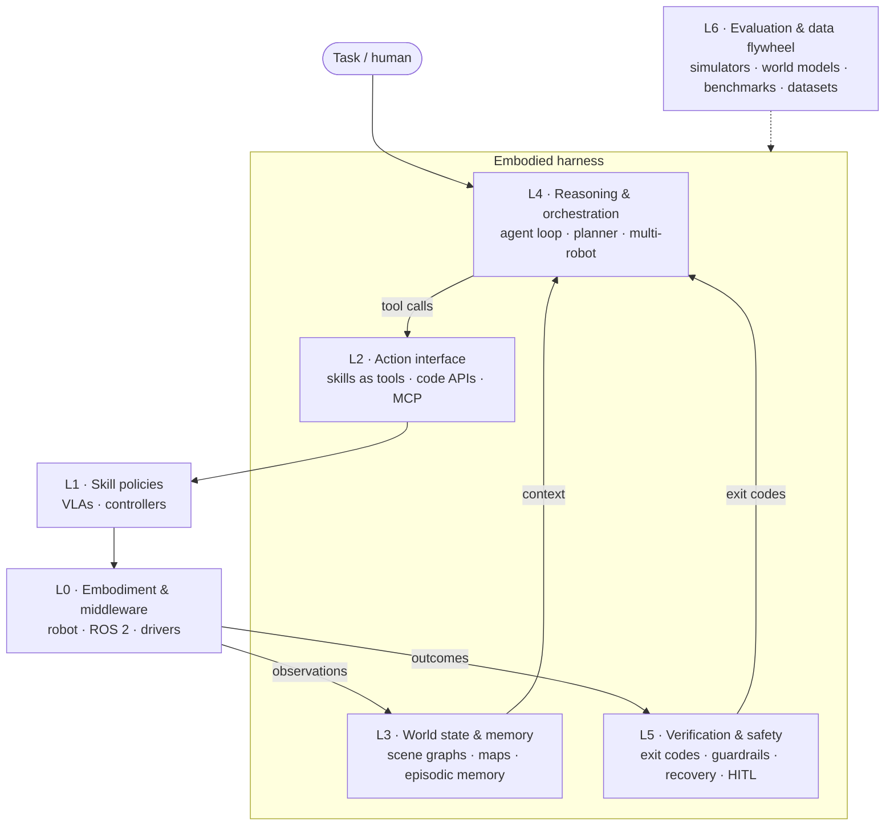

# Awesome Embodied Harness [](https://awesome.re)

<!-- BEGIN GENERATED: badges -->
   
<!-- END GENERATED: badges -->

> A curated, continuously updated survey of the **embodied harness** stack: everything around a foundation model that turns it into an agent acting in the physical world. A daily radar agent keeps it current.

Coding agents showed that the model is only half the system. Claude Code, Codex and their peers succeed or fail on their **harness**: the loop, the tools, context management, permissions, and tests used as exit codes. Robots are going through the same split. An **embodied harness** wraps an LLM, VLM, VLA or world model with:

- an **agent loop** that plans, calls tools, observes and replans;
- robot capabilities exposed as **tools**: skills, VLA policies, motion primitives, generated code;
- **world state as context**: scene graphs, maps, object and episodic memory;
- **exit codes**: success detection, failure diagnosis and recovery;
- a **safety envelope**: guardrails, permissions, human-in-the-loop;
- the **sim / eval / data flywheel** used to build and test all of the above.

This list covers every layer of that stack, not just the models. [SURVEY.md](SURVEY.md) has the taxonomy, a comparison of representative harnesses, and open problems.



**Legend:** 🟢 open (code, and weights for models) · 🟡 partial (e.g. weights or dataset only) · 🔵 API / product · ⚪ closed (paper, blog or demo only). Hover over a name to see the full paper title. Within each category, entries are grouped by year, newest first.

## Contents

<!-- BEGIN GENERATED: toc -->
- [Surveys & Position Papers](#survey) (0)
- [Embodied Harnesses](#harness) (0)
- [Open-Source Frameworks & Runtimes](#framework) (0)
- [Action Interfaces, Skills & Tool Protocols](#interface) (0)
- [World State, Memory & Spatial Context](#memory) (0)
- [Embodied Reasoning Models & Planners](#brain) (0)
- [VLA Models & Skill Policies](#policy) (0)
- [World Models](#world-model) (0)
- [Verification, Failure Detection & Recovery](#verification) (0)
- [Safety, Guardrails & Security](#safety) (0)
- [Multi-Robot & Fleet Orchestration](#multi-agent) (0)
- [Simulators & Environments](#sim) (0)
- [Benchmarks & Evaluation](#benchmark) (0)
- [Data, Teleoperation & Training Infrastructure](#data) (0)
<!-- END GENERATED: toc -->
- [Daily radar](#daily-radar) · [Recently added](#recently-added) · [Contributing](#contributing) · [Citation](#citation)

## Daily radar

Every day a scheduled agent scans arXiv, Hugging Face, GitHub, lab blogs and news. It checks each find against primary sources, adds qualifying systems to [`data/`](data), and writes a log to [`radar/log/`](radar/log). The procedure is in [radar/PLAYBOOK.md](radar/PLAYBOOK.md) and the watch list is in [radar/sources.yaml](radar/sources.yaml).

<!-- BEGIN GENERATED: radar -->
_No radar runs yet._
<!-- END GENERATED: radar -->

## Recently added

<!-- BEGIN GENERATED: recent -->
_No additions since the initial import on 2026-09-29. The daily radar lists new entries here._
<!-- END GENERATED: recent -->

<!-- BEGIN GENERATED: list -->
<a id="survey"></a>
## Surveys & Position Papers

> Surveys, position papers and essays that frame embodied agents and their harnesses.  
> Layer: meta · 0 entries

_Nothing here yet._

<a id="harness"></a>
## Embodied Harnesses

> Systems where an LLM/VLM-driven agent loop orchestrates robot capabilities (skills, VLAs, motion primitives, generated code) and closes the loop on feedback.  
> Layer: L4 · 0 entries

_Nothing here yet._

<a id="framework"></a>
## Open-Source Frameworks & Runtimes

> Robot-agent frameworks, runtimes and SDKs you can install and run today.  
> Layer: L0-L4 · 0 entries

_Nothing here yet._

<a id="interface"></a>
## Action Interfaces, Skills & Tool Protocols

> How robot capabilities are exposed to models: skills as tools, code-as-action APIs, MCP servers, semantic action spaces, keypoint and affordance constraints.  
> Layer: L2 · 0 entries

_Nothing here yet._

<a id="memory"></a>
## World State, Memory & Spatial Context

> Scene graphs, semantic maps, spatial and episodic memory; the harness's context window onto the world.  
> Layer: L3 · 0 entries

_Nothing here yet._

<a id="brain"></a>
## Embodied Reasoning Models & Planners

> "System 2" models trained or adapted for embodied reasoning, spatial grounding, pointing and task planning.  
> Layer: L4 · 0 entries

_Nothing here yet._

<a id="policy"></a>
## VLA Models & Skill Policies

> "System 1" vision-language-action models and skill policies a harness calls, including hierarchical and dual-system designs.  
> Layer: L1 · 0 entries

_Nothing here yet._

<a id="world-model"></a>
## World Models

> Learned world models and simulators used for planning, policy evaluation and data generation.  
> Layer: L6 · 0 entries

_Nothing here yet._

<a id="verification"></a>
## Verification, Failure Detection & Recovery

> "Exit codes" for robots: success detection, failure reasoning, self-reflection, recovery and knowing when to ask for help.  
> Layer: L5 · 0 entries

_Nothing here yet._

<a id="safety"></a>
## Safety, Guardrails & Security

> Guardrails, permissions, constitutions, red-teaming and security of model-driven robots.  
> Layer: L5 · 0 entries

_Nothing here yet._

<a id="multi-agent"></a>
## Multi-Robot & Fleet Orchestration

> Coordinating multiple robots, fleets and human-robot teams with language-model agents.  
> Layer: L4 · 0 entries

_Nothing here yet._

<a id="sim"></a>
## Simulators & Environments

> Physics simulators, rendering stacks and environment platforms for building and testing harnesses.  
> Layer: L6 · 0 entries

_Nothing here yet._

<a id="benchmark"></a>
## Benchmarks & Evaluation

> Benchmarks, evaluation suites and leaderboards for embodied agents, reasoning models and VLAs.  
> Layer: L6 · 0 entries

_Nothing here yet._

<a id="data"></a>
## Data, Teleoperation & Training Infrastructure

> Datasets, data-collection and teleoperation systems, and training frameworks.  
> Layer: L6 · 0 entries

_Nothing here yet._
<!-- END GENERATED: list -->

## Contributing

The list, contents, radar and "recently added" sections are generated from YAML. Edit `data/<category>.yaml`, never the list in this README, then run:

```bash
python3 scripts/awesome.py find "<name or url>"   # make sure it is not already listed
python3 scripts/awesome.py validate
python3 scripts/awesome.py build
```

See [CONTRIBUTING.md](CONTRIBUTING.md) for the entry schema and inclusion criteria. Pull requests and issues suggesting systems are welcome.

## Citation

```bibtex
@misc{awesome_embodied_harness_2026,
  title        = {Awesome Embodied Harness: A Living Survey of the Embodied Agent Harness Stack},
  author       = {{SourceMind Intelligence} and contributors},
  year         = {2026},
  howpublished = {\url{https://github.com/SourceMind-Intelligence/ai-radar/tree/main/awesome-embodied-harness}}
}
```

## License

[CC0 1.0](LICENSE). To the extent possible under law, the contributors have waived all copyright and related rights to this list.
